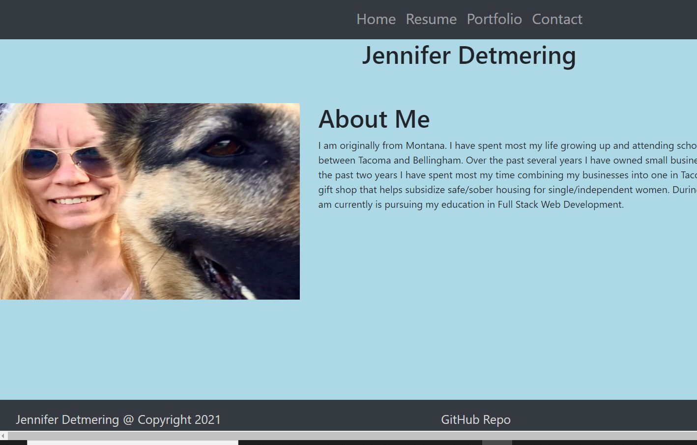

## Responisve Portfolio
by Jennifer Detmering

## Description

This is my responsive portfolio. I compare it to an online resume. My responisve portfolio includes my personal and profesional history and goals. The Portfolio link has links to several projects related to technology, graphic design, and commercial projects. A link is also provided to enable user to contact me for further information.

## Technologies Used- 
HTML, CSS, Bootstrap

## Installation

<h1>Link to Portfolio</h1>

<h3 href="https://kodiakshuksan.github.io/Responsive-Portfolio/">Portfolio Link</h3>

## Usage and Picture of Portfolio

Use navigation bar to follow links to learn more about me personally and professionally. I included a link to my portfolio projects. Please use my contact link if you have any further questions or would like further information.

## Credits

<h3 href="w3schools.com">W3 Schools Link</h3>

## License

<a href="LICENSE.txt">License Document<a>

## HTML Validation

<h3 href="w3schools.com">HTML Validation</h3>

